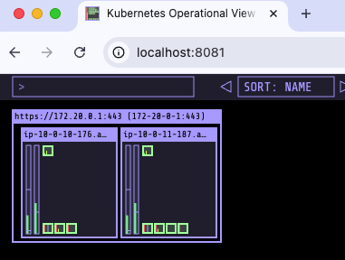
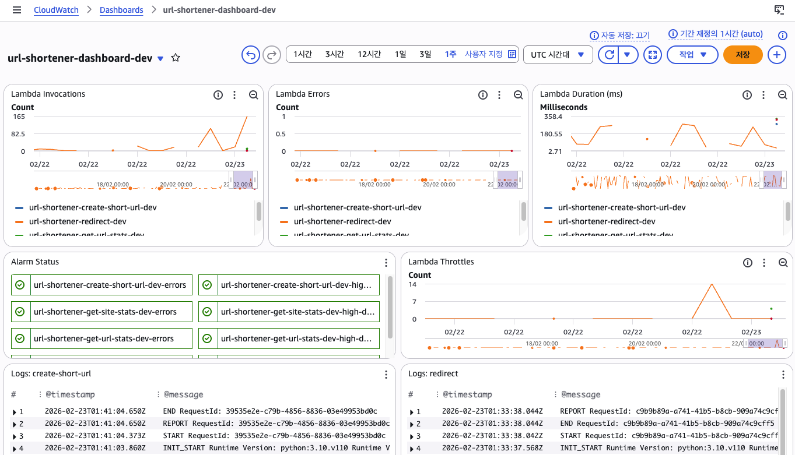
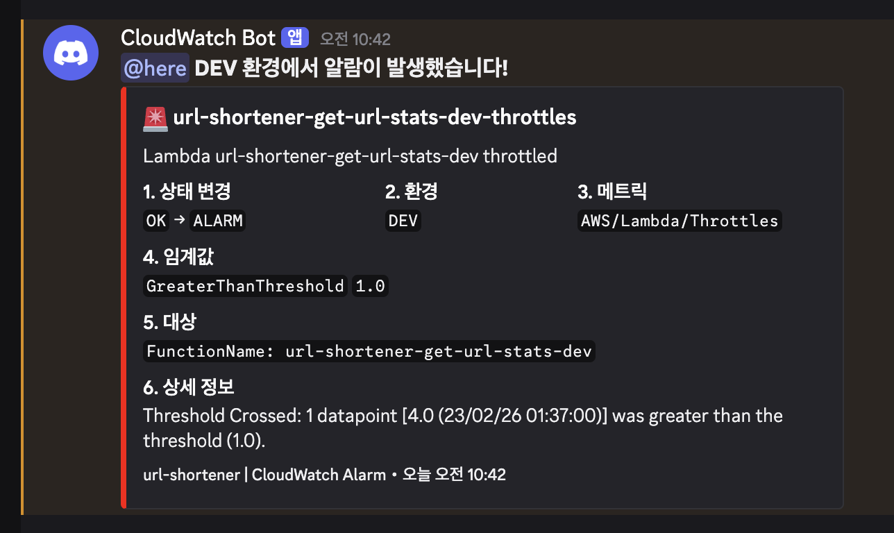
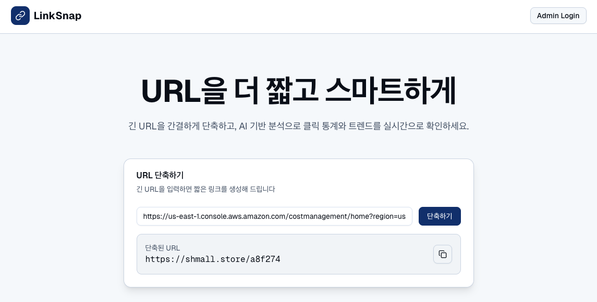
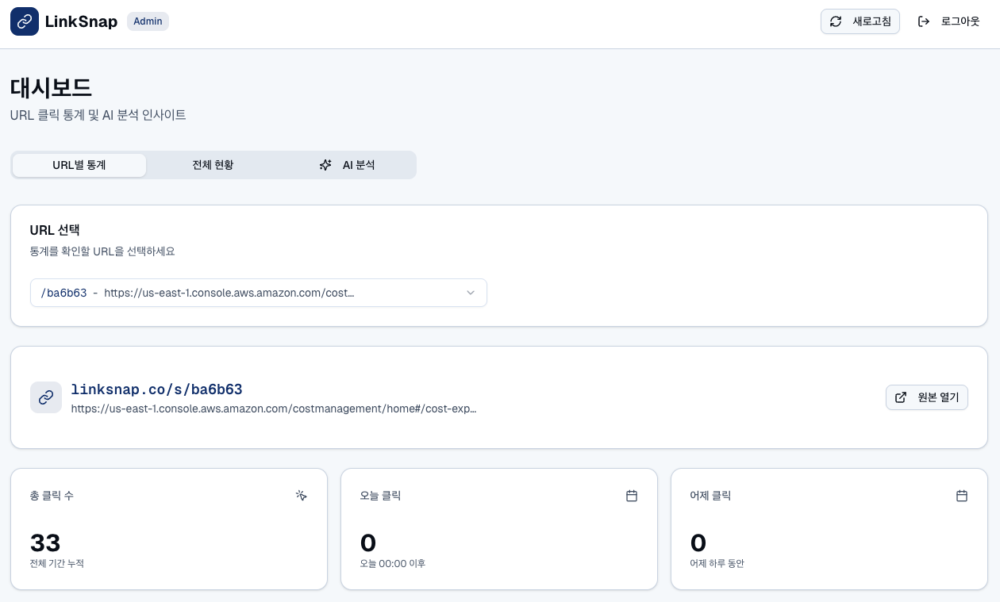
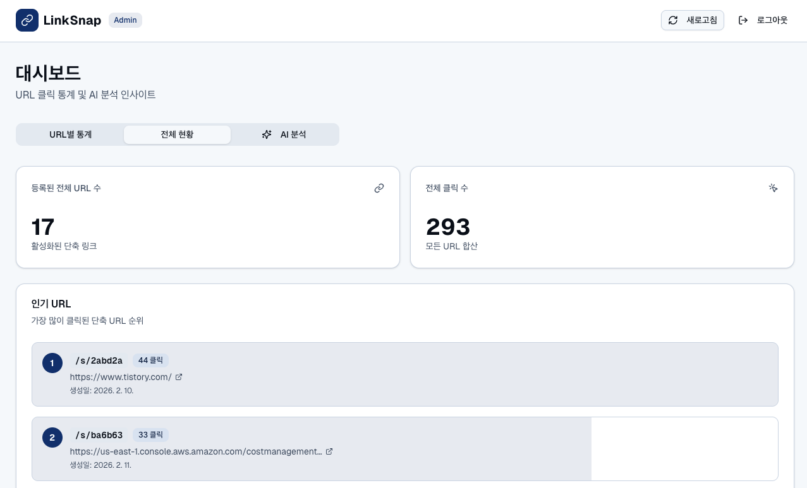
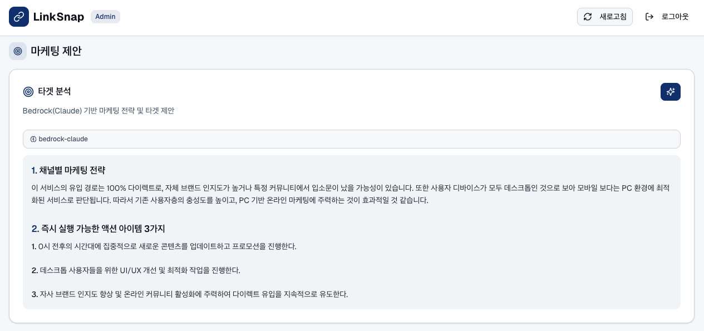

## LinkSnap - URL Shortener Backend

AWS 기반 서버리스 URL 단축 서비스

Terraform으로 인프라를 관리하며 Lambda + API Gateway + DynamoDB 아키텍처와 EKS k8s 클러스터를 병행 운영합니다.


### 1. 아키텍처 구성도


```
[사용자] → [API Gateway / ALB] → [Lambda 함수 or K8s Pod]
                                        ↓
                                   [DynamoDB]
                                   ├── urls 테이블 (URL 저장)
                                   └── stats 테이블 (클릭 통계)

[CloudWatch] → [SNS] → [Discord Alert Lambda] → [Discord Webhook]
[Bedrock Claude 3 Haiku] → [AI Insights API]
```


### 2. 기술 스택

| 구분 | 기술 |
|---|---|
| IaC | Terraform (모듈 구조) |
| Compute | AWS Lambda (Python 3.10), EKS (FastAPI 컨테이너) |
| API | API Gateway HTTP API v2 |
| Database | DynamoDB (urls, stats 테이블) |
| AI | AWS Bedrock (Claude 3 Haiku) |
| Monitoring | CloudWatch (Logs, Alarms, Dashboard) |
| Alerting | SNS → Lambda → Discord Webhook |
| DNS | Route 53 + ACM (커스텀 도메인: shmall.store) |
| Container | ECR, EKS, Docker |
| K8s 시각화 | kube-ops-view |


### 3. API 엔드포인트

3.1 URL Shortener API

Base URL: `https://shmall.store`

| Method | Path | 설명 |
|---|---|---|
| POST | /shorten | URL 단축 생성 |
| GET | /{shortCode} | 원본 URL로 301 리다이렉트 |
| GET | /stats | 전체 사이트 통계 조회 |
| GET | /stats/{shortCode} | 개별 URL 통계 조회 |

3.2 AI Insights API

| Method | Path | 설명 |
|---|---|---|
| POST | /insights | AI 마케팅 인사이트 생성 (Bedrock Claude 3 Haiku) |

분석 타입: `full`, `traffic`, `conversion`


### 4. 인프라 분리 전략

세 개의 Terraform 프로젝트를 **독립적으로** 관리하여 비용을 최적화합니다.

| 프로젝트 | 용도 | 운영 방식 | 월 비용 |
|---|---|---|---|
| `terraform/` | Lambda, API GW, DynamoDB, CloudWatch | 항상 유지 | 프리 티어 |
| `terraform-ai/` | Bedrock AI Lambda | 항상 유지 | 사용량 기반 |
| `terraform-k8s/` | EKS 클러스터 | 필요 시 apply/destroy | 사용 시간 기반 |


### 5. EKS Kubernetes 구성

| 5.1 클러스터 사양 | 5.2 K8s 리소스 |
|---|---|
| <table><tr><th>항목</th><th>설정</th></tr><tr><td>EKS 버전</td><td>1.29</td></tr><tr><td>노드 타입</td><td>t3.small (2 vCPU, 2GB)</td></tr><tr><td>노드 수</td><td>min 1 / desired 2 / max 3</td></tr><tr><td>네트워크</td><td>VPC + Subnet 2개씩</td></tr><tr><td>이미지 저장소</td><td>ECR (최근 5개 유지)</td></tr></table> | <table><tr><th>리소스</th><th>설명</th></tr><tr><td>Namespace</td><td>linksnap - 리소스 격리</td></tr><tr><td>ConfigMap</td><td>DynamoDB, 리전 환경변수</td></tr><tr><td>Deployment</td><td>FastAPI Pod 2개</td></tr><tr><td>Service</td><td>ClusterIP (내부 네트워크)</td></tr><tr><td>Ingress</td><td>ALB 연동</td></tr><tr><td>HPA</td><td>CPU 70% 초과 시 자동 확장</td></tr></table> |

| 5.3 컨테이너 앱 | 5.4 kube-ops-view 시각화 |
|---|---|
| Lambda 4개를 FastAPI 1개로 통합 <table><tr><th>Lambda</th><th>엔드포인트</th></tr><tr><td>shorten_url.py</td><td>POST /shorten</td></tr><tr><td>redirect.py</td><td>GET /{shortCode}</td></tr><tr><td>get_site_stats.py</td><td>GET /stats</td></tr><tr><td>get_url_stats.py</td><td>GET /stats/{shortCode}</td></tr><tr><td>test용</td><td>GET /health</td></tr></table> | 노드와 Pod 배치를 시각적으로 모니터링 <br/> |


### 6. CloudWatch 모니터링 + Discord 알람

| 6.1 대시보드 구성 | |
|---|---|
| <table><tr><th>위젯</th><th>내용</th></tr><tr><td>Invocations / Errors / Duration</td><td>메트릭 그래프</td></tr><tr><td>Alarm Status</td><td>알람 상태 표시</td></tr><tr><td>함수별 Error Logs</td><td>에러/예외 로그</td></tr><tr><td>함수별 Recent Logs</td><td>최근 로그</td></tr><tr><td>Redirect / Stats Failure</td><td>리다이렉트 상세 로그</td></tr><tr><td>Cold Start / Execution Report</td><td>성능 분석 로그</td></tr></table> |  |

| 6.2 알람 → Discord 알림 | |
|---|---|
| <table><tr><th>알람</th><th>조건</th><th>임계값</th></tr><tr><td>Lambda 에러</td><td>5분간 에러 수 초과</td><td>5회</td></tr><tr><td>Lambda 실행시간</td><td>5분간 평균 초과</td><td>5,000ms</td></tr><tr><td>Lambda 스로틀</td><td>스로틀 발생</td><td>1회</td></tr><tr><td>API 5XX 에러</td><td>5분간 5XX 초과</td><td>10회</td></tr><tr><td>API 4XX 에러</td><td>5분간 4XX 초과</td><td>50회</td></tr><tr><td>API 지연시간</td><td>5분간 평균 초과</td><td>3,000ms</td></tr><tr><td>로그 에러 감지</td><td>ERROR/Exception 로그</td><td>3회</td></tr></table> |  |


### 7. 스크린샷

| 메인 페이지 | CloudWatch 대시보드 1 |
|---|---|
|  |  |

| CloudWatch 대시보드 2 | AI 인사이트 |
|---|---|
|  |  |

